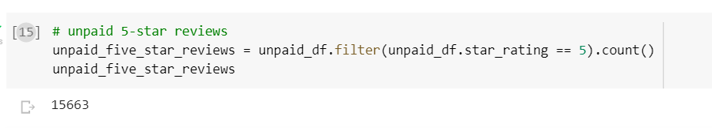

# Amazon_Vine_Analysis

## Analysis Overview
This project explores the Amazon Vine service to see if there is a predominance of favourable Vine users' reviews.
In order to extract the dataset, transform the data, connect to an AWS RDS instance, load the changed data into pgAdmin, and calculate various metrics, the study uses PySpark to carry out the ETL process.

## Results

* How many Vine reviews and non-Vine reviews were there?

- Vine reviews 

 

- Non-Vine reviews 

 

* How many Vine reviews were 5 stars? How many non-Vine reviews were 5 stars?

- 5 Star Vine reviews 

 

- 5 Star Non-Vine reviews 

 

* What percentage of Vine reviews were 5 stars? What percentage of non-Vine reviews were 5 stars?

- Percentage of Vine reviews with 5 Stars 

 

- Percentage of Non-Vine reviews with 5 Stars 

 

## Summary
Only 39% of reviews that weren't part of the Vine programme were rated with five stars, compared to 51% of Vine reviews. This explains an optimism bias for Vine programme reviews.
In addition, we could evaluate the statistical distribution of the star rating for both Vine and non-Vine reviews.

